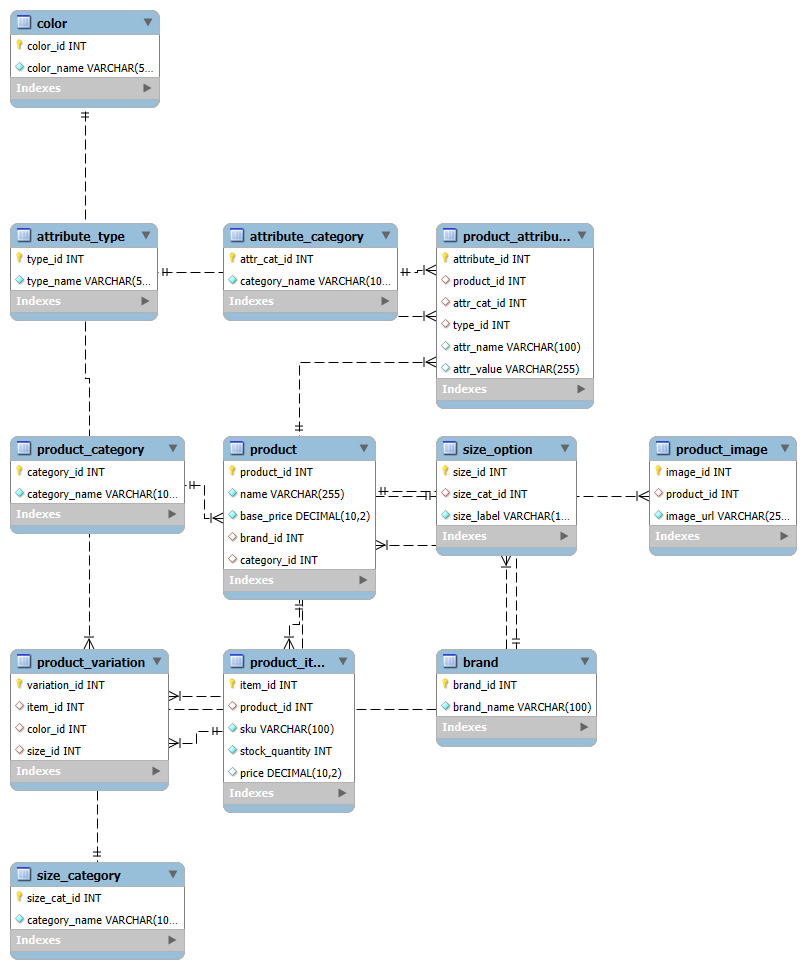

# eCommerceDB_group_381
# 🛒 E-Commerce SQL Database

This project is a sample SQL schema for an e-commerce platform. It models a typical online store, covering *brands*, *products*, *variations*, *categories*, *inventory*, *images*, and *attributes*. It includes sample data for *5 real-world brands* (excluding Nike, Apple, and Samsung) with *5 products each*, totaling 25 products.

## 📂 Database Overview

*Database name:* ecommerce

### Tables and Their Purpose

| Table Name         | Description                                            |
|--------------------|--------------------------------------------------------|
| brand              | List of product brands (e.g. Puma, Dell)               |
| product_category   | Categories like Footwear, Electronics, Clothing        |
| product            | Base product details including brand and category      |
| product_image      | Stores image URLs for each product                     |
| color              | Possible product colors                                |
| size_category      | Categories of sizes (e.g. Clothing Sizes, Shoe Sizes)  |
| size_option        | Specific sizes linked to categories (e.g. M, L, 42)    |
| product_item       | Specific inventory items with SKU, price, and stock    |
| product_variation  | Connects item to color and size options                |
| attribute_type     | Type of attribute value (Text, Number, etc.)           |
| attribute_category | Attribute grouping (e.g. Style, Technical)             |
| product_attribute  | Custom attributes per product (e.g. Material, Weight)  |

---

## 🚀 Sample Brands & Products

- *Puma*: Sneakers, Hoodies, Jackets
- *Dell*: XPS, Inspiron, Latitude
- *HP*: Spectre, Envy, Pavilion
- *LG*: Fridge, Washing Machine, AC
- *Reebok*: Classic Sneakers, Sportswear

Each brand has 5 products, with image links, variations, and a few attributes.

## 📊 ERD Diagram

## 💻 How to Use

1. Run the script ecommerce.sql in your MySQL-compatible database.
2. The script will:
   - Create the ecommerce database
   - Create all tables
   - Populate them with sample data
3. Use MySQL Workbench to explore the data.

## 🔧 Requirements

- MySQL 5.7+ or compatible (MariaDB, etc.)
- SQL client like MySQL CLI, Workbench

## 📫 Contact

Feel free to reach out if you have questions or want to contribute!

## 📝 License

This project is open-source and available under the MIT License.
